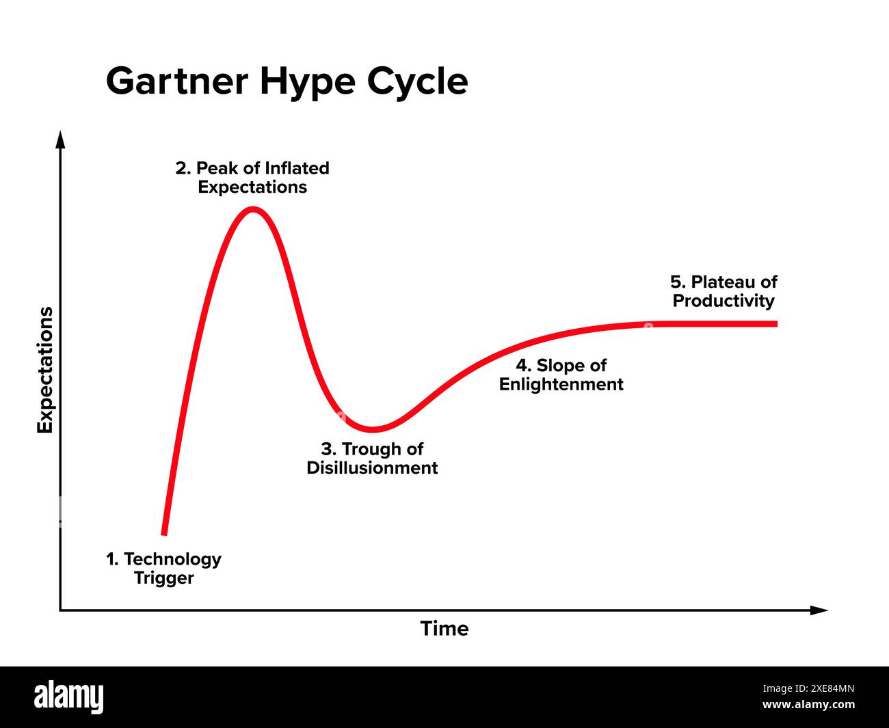
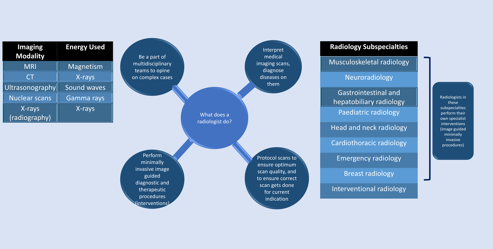
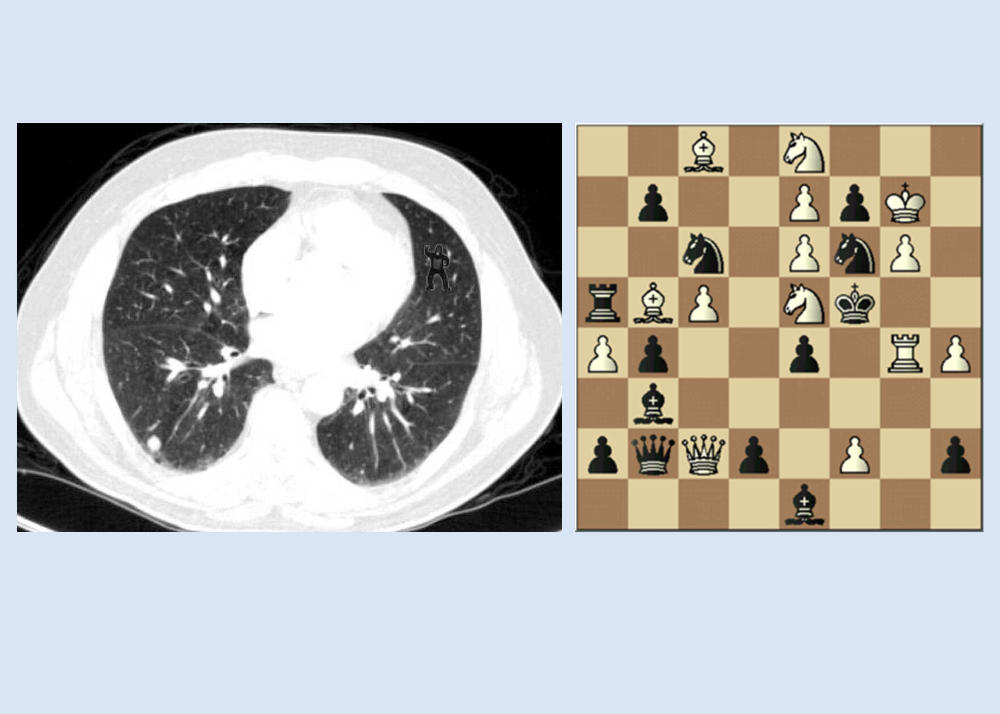
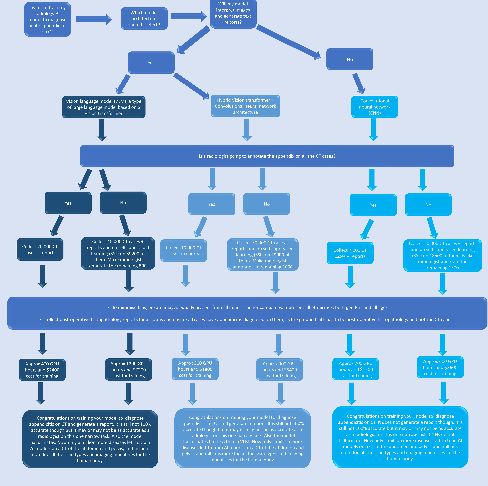
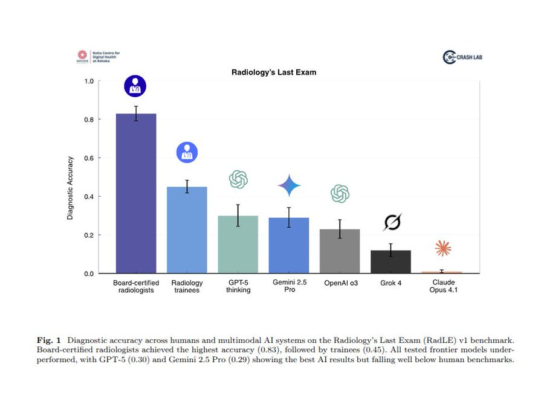
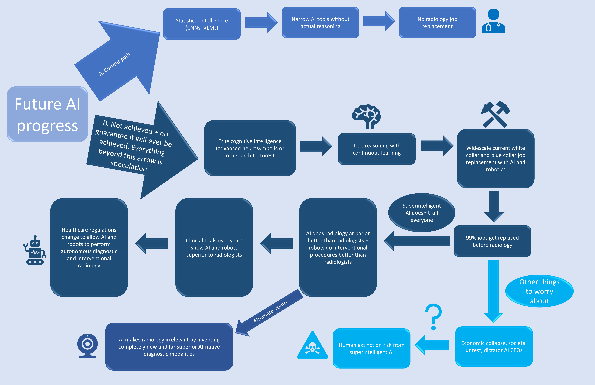

*This article is based on my talk on the hype versus reality of radiology AI for the Radiology Education Foundation (REF), India on the first Sunday of October 2025, with a few additions.*

 

> "I think that if you work as a radiologist, you are like Wile E. Coyote in the cartoon. You're already over the edge of the cliff, but you haven't yet looked down. There's no ground underneath. People should stop training radiologists now. It's just completely obvious that in five years deep learning is going to do better than radiologists."

--Geoffrey Hinton, the Godfather of AI and 2024 Nobel prize winner in physics for his work on machine learning and artificial neural networks. Quote dated 24th of November, 2016.[1]

Hinton said this when I was a third year trainee in radiology. Not many in radiology took AI seriously back then. I proceeded to ignore Hinton (what else could I do), worked in Mumbai’s public and private sector as a radiologist, did a fellowship in musculoskeletal radiology from Netherlands and am now working as a musculoskeletal radiologist in the NHS in England. En route I worked at the Paris Olympics 2024 as a musculoskeletal radiologist where I had my first meaningful and clinically useful experience of using AI in my radiology workflow, using large language models for translating the medical imaging reports across languages for athletes from different countries (which were of course verified before dispatch by radiologists speaking those languages).

I am writing this as someone who is optimistic about the long-term beneficial effects of AI for humanity. The recent hype surrounding large language models (LLMs) has made its way into radiology as well. For us we are more concerned with vision language models or VLMs for image interpretation. VLMs are a type of LLMs. Since the launch of ChatGPT I myself admit to being affected by the AI hype when I did not know better.
To understand the reality of radiology AI, I decided to study it deeply. I trained an X-ray bone age estimation model myself fully end-to-end (did transfer learning to be specific), built a radiology reporting assistant powered by a large language model (LLM) and an automatic speech recognition (ASR) model [2], read deep learning books and articles and also went deep into AI deployment logistics in healthcare in order to try and deploy an edge AI tool to speed up doctors’ workflows and cut down patients’ waiting lists in the NHS. I have also now seen a few narrow radiology AI tools in practice.

I have no financial stake in the radiology AI industry (apart from being an investor in Nvidia through the stock market since 2020) so I am able to give an unbiased view. This article is intended for medical students considering a career in radiology but facing a barrage of “AI will replace radiologists” fear mongering and for radiologists and radiology trainees seeking a distilled overview of the state of radiology AI today and what to expect going forward.

In my radiology AI journey I have gone through all stages of the Gartner’s hype cycle (thanks to my friend and musculoskeletal radiologist based in London Dr. Devpriyo Pal for recently introducing me to this concept). Gartner’s hype cycle describes any new technology’s journey in 5 phases (see image below). We have not achieved phase 5 of the cycle in radiology AI and will not reach it for a long time. But by the end of this article I hope you will have reached phase 4 for radiology AI if you are not already there.

<figure>  <figcaption>Image courtesy: https://www.forbes.com/sites/johnwerner/2024/07/18/the-trough-of-disillusionment-and-four-outliers-on-the-gartner-hype-cycle/</figcaption> </figure>

## 1.   What is radiology?
   
Everything in our universe is made up of one of two things, either matter or energy. Radiology in its essence is the applied science of using energy to look at matter.

Most people on Earth do not know what it is exactly that radiologists do. Many do not know that radiologists are doctors. After finishing undergraduate medical training, those doctors who complete a post-graduate degree in radiology become radiologists.

Radiology is now so vast that most radiologists end up specializing in one or two organ systems. There is a vast subspecialty of radiology which is concerned with performing complex and lifesaving minimally invasive image-guided procedures, called interventional radiology (IR).

<figure>  <figcaption>Overview of radiology and its subspecialties. Click to enlarge.</figcaption> </figure>

## 2. Imagine you are a radiologist at work
You are sitting at your reporting workstation. In a typical day you will go through 10s if not 100s of different scans of many different imaging modalities. Suppose you are on a busy emergency shift one night and open a CT scan of the abdomen and pelvis to report. It is of a 30 year old patient with severe abdominal pain. When you scroll through the scan you will see it has thousands of images. On each image you will see at least 50 structures, and each of these structures could have 10s to 100s of different things going wrong with it.

As you are scrolling through the CT, you see that the patient has thickening in their small bowel loops. Imaging findings of different diseases often have an overlap, it is seldom a straightforward black and white diagnosis, and radiologists are almost always dealing with shades of grey (and those are the colours of the scans as well). In this patient with small bowel thickening, tuberculosis of the small intestine, Crohn’s disease and early small intestine cancer are all possibilities. You look for ancillary findings on the scan which will confirm or refute each of these diagnoses. Are there adjacent enlarged lymph nodes, how do the lymph nodes look, is there peritoneal thickening, are there any findings in the lower lungs which have been covered on the scan, how are the bones, the liver, spleen, pancreas, kidneys and so on. You go through the patient’s labs again to search for anything which might give a clue.

Critical imaging findings which lead to a diagnosis are also often subtle, hidden in corners of scans. We radiologists combine our general medical training knowledge with specialized medical imaging training to interpret scans and arrive at a diagnosis.

Experienced radiologists are like chess grandmasters, adept at finding recurring patterns on scans and knowing where to look for a certain constellation of findings, having seen thousands of cases of a particular type throughout their career. A study showed radiologists missing a gorilla on a chest CT just because they were not expecting it to be there.[3] Chess grandmasters have been shown to be unable to recreate a chess board in which the pieces are arranged in a random order which does not follow standard patterns in a chess game.[4]

<figure>  <figcaption>83% radiologists missed the gorilla on this CT as it is not a part of the regular imaging patterns seen on scans. Chess grandmasters find it difficult to recall chess pieces arranged randomly on a chess board which do not follow progression patterns of a regular chess game.</figcaption> </figure>

Yet radiology has an even larger number of variations compared with chess as medicine is messy, biology is not math and scans don’t always turn out the way they should. If you are a radiologist you will often come across what are called ‘artifacts’, things which appear on images based on the scanner or a certain tissue’s inherent properties and may sometimes provide clues to the diagnosis, but most often spoil the party and obscure parts of the image. Examples are motion artifacts from the patient moving in the scanner or metal artifacts on an image from a joint prosthesis which blur nearby anatomy.

Our imaging modalities themselves are not 100% in sensitivity, specificity, positive predictive value and negative predictive value, because of which an AI trained on medical imaging can never itself be 100% accurate. But maybe that is not the goal of AI companies, they might not be after 100% accuracy. They just want to create an AI which matches 
or surpasses radiologists in accuracy. Let’s see what training AI models in radiology actually consists of.

## 3. How do you train your own radiology AI model?

To demonstrate how AI radiology models are trained today, I made a flow-chart showing all the steps which should make the realities of AI in radiology clear, along with the limitations and challenges faced.

<figure>  <figcaption>Pathway for training an AI model for diagnosing acute appendicitis on CT showing the realities and required costs. Click to enlarge.</figcaption> </figure>

## 4. What about radiology foundation models?

Radiology foundation models are supposed to be AI models which can do everything that a radiologist can do apart from performing procedures i.e. interpret medical images, protocol scans, do segmentation of structures on scans. The first radiology foundation model was from China and released open source in 2023.[5]

So far the results from radiology foundation models have been disappointing. A recent MRI foundation model from Harvard had glaring mistakes in its published images with the model getting basic diagnoses incorrect or hallucinating findings which were not there. This is the result after training a foundation model on 220,000 MRI scans and 19 million MRI slices.[6]

This leads us to question whether transformer-based vision language models are even the optimum architecture to be trying to build radiology foundation models, given that they hallucinate and also require such large amount of training data and GPU costs.

## 5. The reality of AI in radiology today

Many radiology AI models are getting US FDA clearance. FDA clearance is completely different from FDA approval, and does not at all mean the models are clinically safe. It is worthwhile for radiologists in clinical practice to be aware of this difference when evaluating AI tools for trial in their practice.

<figure>  </figure>

Many published papers touting the high sensitivity and specificity of these AI tools have major conflicts of interest, with people from the AI companies who trained these models themselves being listed as co-authors on the papers. An even more concerning trend is the authors having a clear conflict of interest by being a part of the AI company which trained the model, but not disclosing this in the published paper. Radiologists looking to deploy an AI tool in their practice are encouraged to read the literature on the model thoroughly before investing money, and the CLAIM checklist is a good starting point to become familiar with how to evaluate AI tools.[7]

Most of the models which have received FDA clearance are narrow task convolutional neural networks (CNNs). These are just tools and are not replacing anyone. There are recent promising advances in mammography where CNNs have been found to be as good or better than a radiologist as a second reader.[8] It is the limited scope of pathologies for diagnosis on a mammogram which makes it the perfect candidate for AI. Even then this model is not replacing breast radiologists and is just a tool in their workflow, freeing them up to perform ultrasounds, MRIs and image guided breast interventions.

A recent study showed that even though mammography AI tools may be picking up more lesions, they do not justify the costs in the long run.[9]

A common misconception which non-radiologists have is that computer vision in radiology is basically solved and there are now a huge number of clinically useful models available to radiologists which are already clinically deployed. There is also a common misconception that AI models in radiology are already as good as or better than radiologists. This cannot be further from the truth with only a limited number of narrow task models currently being deployed or trialled around the world. People believe the surge in radiology AI tools has increased the demand for radiologist jobs in the West. AI has nothing to do with it, if you combine all radiology AI tools available today the work they do does not cover even 1% of a radiologist’s daily workflow.

99% hospitals around the world do not have access to a GPU (not even a consumer GPU). GPUs or graphics processing units are powerful processing chips inside computers which are required to train AI models, and also to run most clinically deployable AI models of a reasonable accuracy. GPU costs are in the thousands to hundreds of thousands of dollars, and most of the bigger ones which are relevant for healthcare AI are not available to consumers directly. These are either available to rent through the cloud (which hospitals don’t want because of patient data privacy concerns) or are leased / sold to healthcare systems or governments.

Smaller AI models deployed directly on devices (called edge AI) need to be heavily quantized (in a way made smaller) so that they can run on most healthcare hardware worldwide, which significantly decreases their accuracy and markedly increases hallucinations, thus making them impractical for clinical use today.

A major problem for AI models today is bias. AI models trained on one hospital’s data do not work on images from other hospitals. AI models trained on one type of scanner do not work on other scanners (and there are at least 5 or 6 major scanner companies for each imaging modality worldwide). AI models trained on a particular patient demographic like gender, ethnicity or age do not work on others not in their training data. So when preparing datasets for radiology AI training it becomes necessary to collect images from hospitals around the world, ensure they represent almost every major scanner company, and all ethnicities, male and female patients and all ages.

Hospitals tightly protect patient data including medical images for data privacy as they rightly should, and do not easily provide access to AI companies for training their models on them. Going forward patients should have a say in whether their medical data can be used by AI companies to train models, after all they are the owners of their own data. Today’s LLMs are already facing multiple lawsuits for unlawfully training their models on copyrighted data of writers and artists, allegedly stealing from the output of their decades of hard work and life-long dedication to their craft.

Another major problem with today’s deep learning based models, whether they are CNNs or VLMs is that they are a black box. No one can really explain how these models arrive at the inference they do, not even leading AI researchers and engineers. This is a complete dealbreaker for doctors as any technology which is deployed in healthcare needs to be completely explainable, and its inference steps should be visible transparently for everyone to evaluate. Why is deep learning then treated differently from other technologies?

The only evaluations for AI models in radiology which matter are:
1. Is this AI model beneficial for patient care?
2. Is this AI model saving radiologists’ time, helping them cut down on waiting lists and focus on more complex scans and procedures?
3. Is this AI model helping the healthcare system save money?

So far the results for AI models in radiology have not been promising.

## 6. Deep learning models are not actually reasoning

This may seem a counter-intuitive statement with LLMs from major companies today winning international math Olympiad and other Olympiad gold medals. But it might not be apparent to people working in the domains of mathematics, programming, AI research or engineering in general what doctors have always noticed about LLMs when applied to real world medical tasks and are now slowly publishing papers on.

LLMs are not reasoning on medical tasks.

They are extremely good next token predictors, which enables them to be very useful for literature and web search and presenting ideas which are already published on the internet in an understandable way to the user.

But any doctor who has tested LLMs (including me testing GPT-5, today’s leading LLM) can attest that the models crumble when queried on real world day to day medical cases which may not have published literature, with or without images. The models readily hallucinate medical signs or conditions which do not exist (even GPT-5) when probed on a challenging case long enough. Real world medicine is not like the cases published online as interesting case vignettes, and real life does not have multiple choice questions from which one can select options.

The very nature and ordered structure of math and coding makes it accessible for LLMs to master, also because synthetic data can be easily created in these domains. One cannot create synthetic medical images without having access to thousands or millions of them first to train an AI model on.

Still software engineers doing truly innovative work and working on novel applications in robotics, military and defence infrastructure, cybersecurity, aerospace and other advanced technologies find LLMs unable to generate any meaningful code for problems which require novel solutions. LLMs are able to create websites and generic apps and games as there is a lot of the code available as training data online. When something is not in their training data, the models fail.

A study by Microsoft on medical tasks found LLMs easily misled and giving wrong answers when the phrasing of the questions was slightly altered from what was earlier available in the online dataset.[10] A recent paper by Dr. Suvrankar Datta and team from New Delhi, India shows the strongest models of today performing much below the level of radiology trainees, and not even matching 50% of the accuracy of radiology consultants.[11]

<figure>  <figcaption>Image courtesy: Datta S. et al. Radiology's Last Exam (RadLE): Benchmarking Frontier Multimodal AI Against Human Experts and a Taxonomy of Visual Reasoning Errors in Radiology.</figcaption> </figure>

This is not an issue which will be solved in a few years, as the reason for the models’ poor performance lies at the very heart of what these models are and how they are trained. The hurdles are critical, like lack of available massive scale high quality radiology data, the models not really reasoning but doing pattern-matching, lack of advances in computer vision efficiency despite the world’s best AI researchers trying for more than a decade and the fundamental problem of hallucinations which is nowhere near being solved.

Hallucinations may not be a problem in low-stakes pursuits like vibe coding apps and games. But in life-or-death high stakes environments like healthcare, even 1 hallucination in 1000 cases is a hallucination too many and may result in real harm to patients, even death. This is the reason why large language models and anything based on them will not find acceptance in healthcare as hallucinations are a fundamental part of the model architecture. It is also funny that there was a recent attempt to train a surgical robot to perform autonomous surgery ‘powered by same architecture as ChatGPT’. What happens when the model hallucinates mid-surgery? Probably general purpose humanoid robotics powered by LLMs today is as big a bubble as AI (not the narrow task industrial robots and surgical robots already in practice which have actual proven uses).

There is also the inherent security risk of today’s AI agents, with companies launching AI agentic browsers and computer use AI agents. While the concept looked initially promising, there are reports of these agentic browsers and computer use agents being vulnerable to prompt injection attacks and other security vulnerabilities which make it impossible for them to be considered for healthcare deployment. And this is again because of the fundamental brittle nature of LLMs.

Proponents of LLMs say that new AI architecture breakthroughs are just on the horizon and that scaling LLMs (making them larger by training them on more data and more compute) will lead to a superhuman AI researcher which can recursively self improve its own architecture leading to an artificial general intelligence (AGI), and then soon to an artificial superintelligence (ASI). But if these models are not really reasoning, there is no indication today that they will themselves discover new science or surpass the level of an elite human AI researcher to recursively self improve.

All of this leads us to conclude probably deep learning itself is not the correct AI paradigm for healthcare as it is a black box, and not amenable (at least today) to continuous learning. Once trained, it is difficult to retrain a model on other medical imaging cases unless you have hundreds or thousands of examples of the new disease.

## 7. Harmful effects of the AI hype on radiology education, and on education in general

The current AI hype is unique in creating a disturbing impact on education, including on radiology education. If people in the AI industry (and even many people who are not working in AI) keep hyping that all jobs will soon be replaced, students and trainees in any profession may be less inclined to pursue excellence and put in peak efforts in order to master a skill or gain knowledge, thinking “what is the point of putting too much effort into learning if I am anyway soon going to be replaced?” This has far reaching effects on entire generations. The AI hype may in fact prove to be false, but many will have lost the opportunity to learn and progress in their life when it mattered.

Also the AI industry’s focus is clearly on automation and replacement of jobs, thus making humans irrelevant and most AI leaders do not hide that this is the future they are pursuing. This enables the concentration of power in the hands of a few and makes the current socioeconomic power which labour holds irrelevant. Rather than deploying AI as a cognition enhancer which empowers people, stimulates their thinking and promotes learning, it is being deployed to the masses as a replacement for critical thinking, eroding their creativity and problem-solving skills.

There also appears to be a shared mass delusion on social media (folie a deux) about an imminent AGI. I sometimes wonder how many AI and tech leaders genuinely believe that this road today leads to AGI and how many are currently victims of an LLM driven hysteria (or AI psychosis) themselves. Doesn’t AGI include the ability to diagnose radiology images accurately and actually reason on medical tasks?

Another genuinely concerning effect of the way AI has been deployed is apps to generate fake videos and fake images which will most likely spell the end of the traditional algorithm driven social media as we know it. There is a dead internet theory which says there will come a point when most interactions online are between AI bots and most content online including text, images, videos will be generated by AI and not by humans. This looks increasingly likely to become a reality with each passing day. Future generations will probably look at the combination of unrestricted algorithm powered social media use plus today’s AI chatbots as a crazy era, the addictive and harmful equivalent of how we see smoking today.

<figure>  <figcaption>Flowchart for the future of AI progress if it stays on the current path of statistical intelligence and another (as of today fictional) path if true cognitive intelligence is ever achieved. Click to enlarge.</figcaption> </figure>

## Conclusion

For medical students interested in radiology, you should absolutely go ahead and choose radiology today if you get the opportunity. Automation and replacement of the profession is nowhere on the horizon, and may not even be achievable for decades. It is easy to make casual remarks saying “AI will replace radiologists”, but difficult to study the subject in detail in order to write a nuanced long-form article explaining the reality. Such statements also cause genuine harm by discouraging students from choosing a profession which may have been more suitable for them rather than other less suitable paths.
I hope AI researchers are able to overcome today’s LLM hype and look at other machine learning paradigms beyond deep learning for healthcare, ones which are not a black box, which are transparent to evaluate, integrate continuous learning in the model’s architecture, are ethical to train, can be safely deployed and most importantly make a meaningful contribution to patient care. Our patients deserve it.

<figure>  <figcaption>Flowchart for when someone says "AI will replace radiologists". Click to enlarge.</figcaption> </figure>

## References

1. [The AI Radiologists Replacement Saga](https://www.datasciencecentral.com/the-ai-radiologists-replacement-saga-dont-be-misled-by-the-scaremongering-science-v-s-science-fiction/)
2. Wilhelm: free and open source radiology reporting assistant. [www.wilhelmai.net](https://www.wilhelmai.net)
3. Drew T, Võ ML, Wolfe JM. The invisible gorilla strikes again: sustained inattentional blindness in expert observers. Psychol Sci. 2013 Sep;24(9):1848–53. [doi: 10.1177/0956797613479386](https://doi.org/10.1177/0956797613479386). Epub 2013 Jul 17. PMID: 23863753; PMCID: PMC3964612.
4. Gobet F, Simon HA. Recall of random and distorted chess positions: implications for the theory of expertise. Mem Cognit. 1996 Jul;24(4):493–503. [doi: 10.3758/bf03200937](https://doi.org/10.3758/bf03200937). PMID: 8757497.
5. Wu, C., Zhang, X., Zhang, Y. et al. Towards generalist foundation model for radiology by leveraging web-scale 2D&3D medical data. [doi: 10.48550/arXiv.2308.02463](https://doi.org/10.48550/arXiv.2308.02463)
6. [doi: 10.48550/arXiv.2508.17524](https://doi.org/10.48550/arXiv.2508.17524)
7. Tejani AS, Klontzas ME, Gatti AA, Mongan JT, Moy L, Park SH, Kahn CE Jr; CLAIM 2024 Update Panel. Checklist for Artificial Intelligence in Medical Imaging (CLAIM): 2024 Update. Radiol Artif Intell. 2024 Jul;6(4):e240300. [doi: 10.1148/ryai.240300](https://doi.org/10.1148/ryai.240300). PMID: 38809149; PMCID: PMC11304031.
8. van Winkel SL, Peters J, Janssen N, Kroes J, Loehrer EA, Gommers J, Sechopoulos I, de Munck L, Teuwen J, Broeders M, Karssemeijer N, Mann RM. AI as an independent second reader in detection of clinically relevant breast cancers within a population-based screening programme in the Netherlands: a retrospective cohort study. Lancet Digit Health. 2025 Aug;7(8):100882. [doi: 10.1016/j.landig.2025.100882](https://doi.org/10.1016/j.landig.2025.100882). Epub 2025 Aug 14. PMID: 40816977.
9. Andersen M, Richman IB, Kunst N. Long-Term Outcomes and Cost-Effectiveness of Artificial Intelligence for Breast Cancer Screening: A Modeling Study. Value Health. 2025 Sep 20:S1098–3015(25)02560–4. [doi: 10.1016/j.jval.2025.09.005](https://doi.org/10.1016/j.jval.2025.09.005). Epub ahead of print. PMID: 40983310.
10. [doi: 10.48550/arXiv.2509.18234](https://doi.org/10.48550/arXiv.2509.18234)
11. Datta S. et al. Radiology’s Last Exam (RadLE): Benchmarking Frontier Multimodal AI Against Human Experts and a Taxonomy of Visual Reasoning Errors in Radiology. [doi: 10.48550/arXiv.2509.25559](https://doi.org/10.48550/arXiv.2509.25559)

